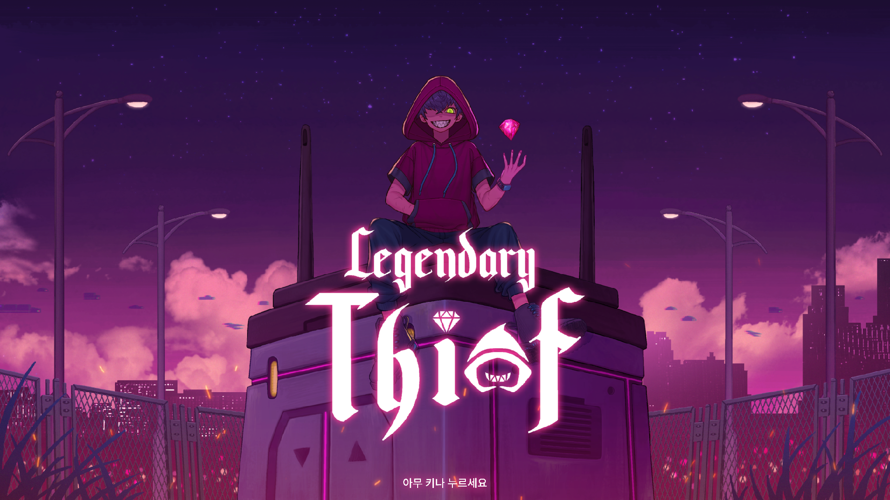
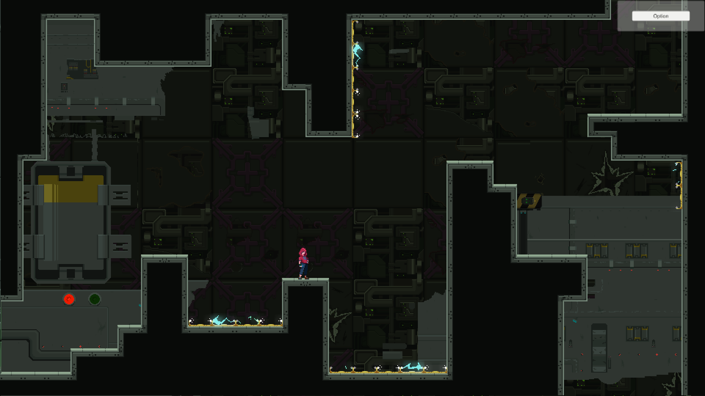
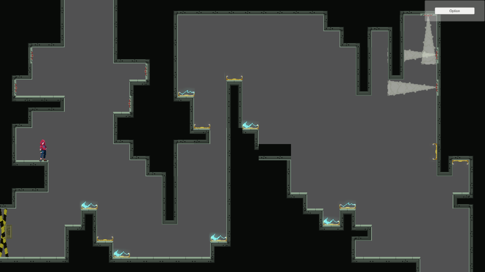
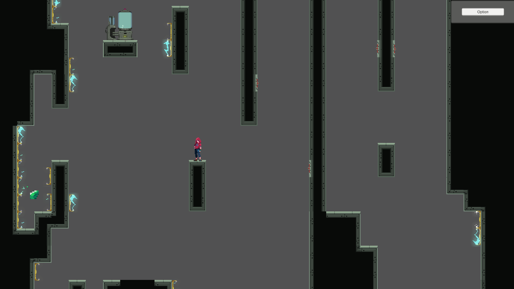

# Legendary Thief  Prototype2
 이 프로젝트는 인디게임팀 **PixelSilo**에서 개발하던 프로젝트의 프로토타입 2번입니다.     
 팀의 1인 프로그래머로 Unity엔진을 사용해 개발하였습니다.
 
  ----
### 어떤 게임인가

   게임명 : LegendaryThief
   타겟 플랫폼 : Android (미출시)
   사용언어, 엔진 : C#, Unity
   
</img></img>
</img></img>

게임 플레이 영상 : https://youtu.be/Zt18w_t6DsU

**게임 소개**
> 레퍼런스 게임 : **Celeste**    
> 전 세계에 퍼져있는 유물을 훔쳐 전설의 대도둑이 되는 스토리를 가지고 있습니다.     
> 2D 플랫포머 게임으로 건물에 있는 각종 함정, 퍼즐 요소를 이용하여 최종스테이지에 있는 유물을 획득하는게 목적입니다.

**Prototype 1과의 차이점**
> 경비로봇(적)이 등장하지 않는 대신 각종 함정이 존재합니다.    
> Prototype1에서는 1개의 Scene에 1개의 맵이 구현되어있었지만, 로딩요소를 줄이기 위하여 1개의 Scene에 스테이지 전체를 넣었습니다.    
> 맵이 커져감에 따른 부하를 최대한 줄이기 위하여 방에 들어갈때만 해당 방의 기믹 요소들이 작동하도록 하였습니다.

----
### 사용한 유니티 기능
 * **애니메이션**
   * **Sprite Sheet**를 이용한 애니메이션 구현.
   * **Animation Controller**의 Transition 및 애니메이션 이벤트를 이용한 코드 구현.
 * **URP(Universal Render Pipeline)**
   * 튜토리얼(대화 부분)의 네온사인 Bloom 효과를 위해 사용.
 * **PixelPerfectCamera**
   * 유니티 Package Manager의 **2D Pixel Perfect** 사용.
 * **Tilemap**
   * 맵 디자인에 Tilemap, TilemapCollider 사용.
 * **Unity Collaborate**
   * 기획자가 직접 맵을 수정하며 테스트를 하기위해 **Unity Collaborate**를 사용하여 협업 진행.
   * 그래픽 디자이너가 Shader의 세부 설정을 수정하기 위하여 **Unity Collaborate**를 사용하여 협업 진행.
